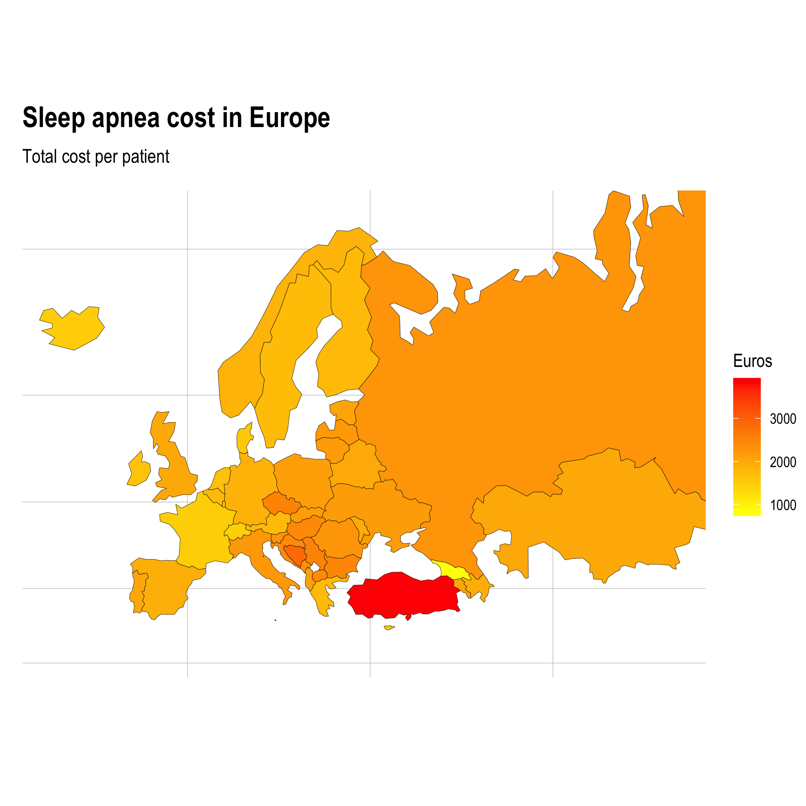

# Sleep Revolution - estimating cost of sleep apnea

THIS PROJECT ESTIMATES SLEEP APNEA COSTS IN EUROPE. DATA IS PUBLICLY AVAILABLE AT <http://ghdx.healthdata.org/> BY CC BY-NC-ND 4.0 LICENCE. RESULTS CAN BE REPLICATED BY THIS PROJECT.

Sleep apnea cost can be estimated by method shown in  *[Armeni et al. (2019) Cost-of-illness study of Obstructive Sleep Apnea Syndrome (OSAS) in Italy](https://cergas.unibocconi.eu/sites/default/files/files/Cost-of-illness-study-of-Obstructive-Sleep-Apnea-Syndrome-%2528OSAS%2529-in-Italy_Report%25281%2529.pdf)*. This project utilize it with open data science methods.

 

## Documentation 

For replicating the results, start with the project **[documentation](https://research.janimiettinen.fi/material/sleep22/index.html)** page and edit your own project following the set of `.Rmd` files starting by `01-flatfiles.Rmd`. Run, render & send the whole project by `run.R` file.

* [Project homepage](https://research.janimiettinen.fi/material/sleep22/index.html)

* [Github project](https://github.com/janikmiet/sleep22)

 
Data: 

[Source](http://ghdx.healthdata.org) CC BY-NC-ND 4.0 LICENCE.

 
Project:
 
Copyright 2022 Jani Miettinen
 
License: CC BY-NC-ND