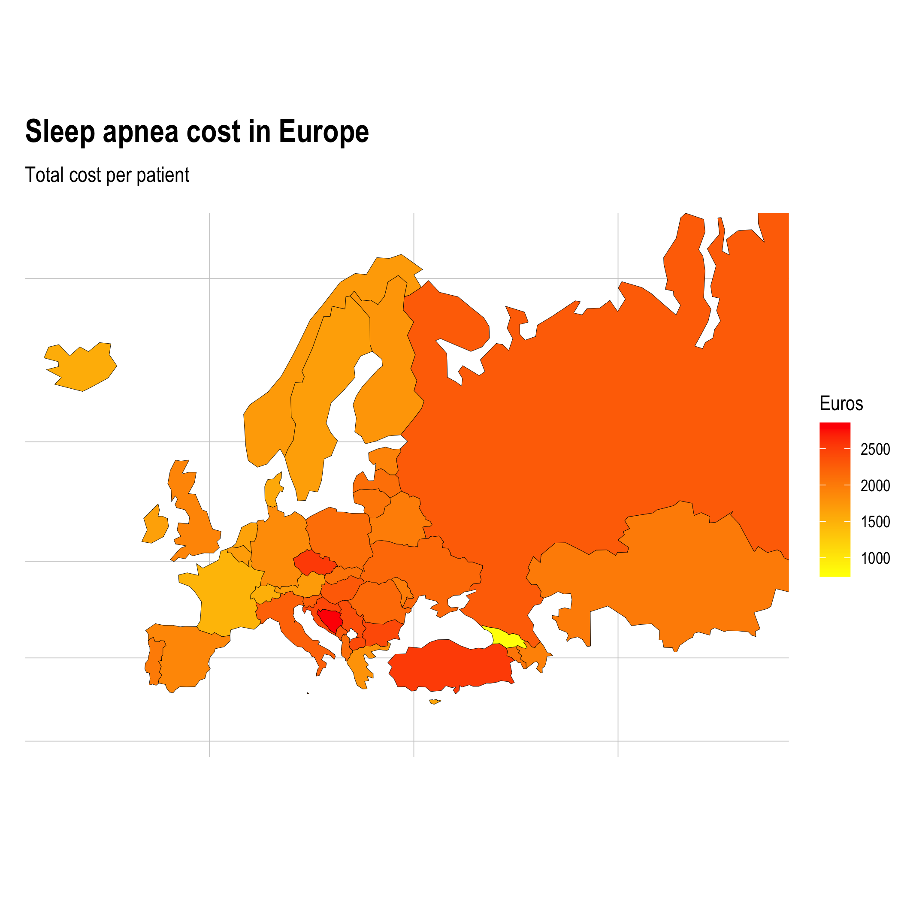

# Estimating costs of sleep apnea

```{r, include=FALSE}
source("global.R")
```

**LAST UPDATE: `r Sys.time()`**

THIS PROJECT ESTIMATES SLEEP APNEA COSTS IN EUROPE. DATA IS PUBLICLY AVAILABLE AT <http://ghdx.healthdata.org/> BY CC BY-NC-ND 4.0 LICENCE. RESULTS CAN BE REPLICATED BY THIS PROJECT.

```{r, fig.cap="Estimated sleep apnea costs in Europe per patient in 2019."}
# plot_europe_cost.png
```


Sleep apnea cost can be estimated by method shown in  *[Armeni et al. (2019) Cost-of-illness study of Obstructive Sleep Apnea Syndrome (OSAS) in Italy](https://cergas.unibocconi.eu/sites/default/files/files/Cost-of-illness-study-of-Obstructive-Sleep-Apnea-Syndrome-%2528OSAS%2529-in-Italy_Report%25281%2529.pdf)*. This project utilize it with open data science methods.

We are interested sleep apnea costs in Europe between age group of 15-74 years old. Data is collected from the year 2019. Following countries are included to the estimation:

```{r echo=FALSE}
countries <- c("Albania","Andorra","Armenia","Austria","Azerbaijan","Belarus","Belgium","Bosnia and Herzegovina","Bulgaria","Croatia","Cyprus","Czechia","Denmark","Estonia","Finland","France","Georgia","Germany","Greece","Hungary","Iceland","Ireland","Italy","Kazakhstan","Latvia","Lithuania","Luxembourg","Malta","Republic of Moldova","Monaco","Montenegro","Netherlands","North Macedonia","Norway","Poland","Portugal","Romania","Russian Federation","San Marino","Serbia","Slovakia","Slovenia","Spain","Sweden","Switzerland","Turkey","Ukraine","United Kingdom")
countries
```


-----

